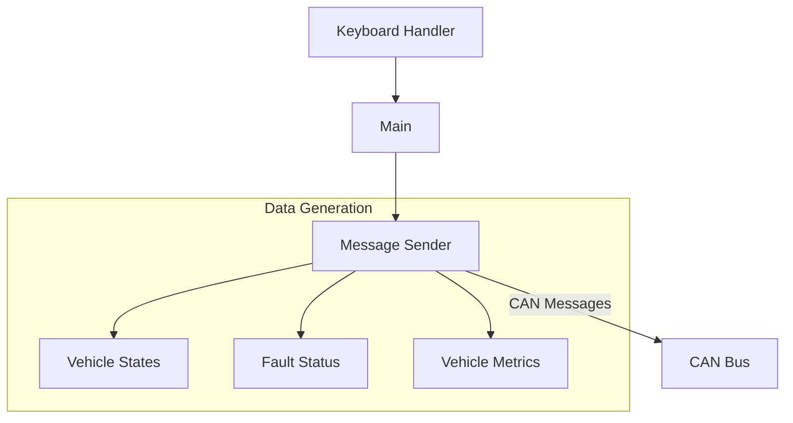

# Vehicle Control Unit (VCU) Simulator
A Python-based Vehicle Control Unit simulator for electric vehicle development, providing real-time state information and vehicle metrics over CAN bus communication.

## Overview
This VCU simulator generates realistic vehicle data and state information, designed for developing and testing automotive infotainment and diagnostic systems. It simulates various vehicle states, fault conditions, and dynamic metrics over a CAN bus interface.

## Features
- Real-time vehicle state simulation
- Dynamic vehicle metrics generation
- Fault injection and monitoring
- Interactive keyboard controls
- Configurable update rates
- Realistic data value simulation

## System Architecture


## CAN Message Structure

### State and Fault Messages
| Message ID | Description | Length | Rate | Details |
|------------|-------------|---------|------|---------|
| 0x600 | Vehicle State | 8 bytes | 100ms | Primary state, substate, status flags |
| 0x601 | Fault Status | 8 bytes | 100ms | Fault source, type, severity, timestamp |

### Vehicle Metrics
| Message ID | Description | Length | Rate | Range |
|------------|-------------|---------|------|-------|
| 0x101 | Charge Percentage | 1 byte | 200ms | 0-100% |
| 0x102 | Charging Rate | 1 byte | 200ms | kW |
| 0x103 | Est. Full Charge Time | 1 byte | 200ms | minutes |
| 0x104 | Battery Temperature | 1 byte | 200ms | 15-45°C |
| 0x201 | Motor Temperature | 1 byte | 200ms | 20-85°C |
| 0x202 | Inverter Temperature | 1 byte | 200ms | °C |
| 0x301 | Tire Temperature | 4 bytes | 500ms | 20-80°C |
| 0x302 | Tire Pressure | 4 bytes | 500ms | 28-36 PSI |
| 0x401 | Power Output | 1 byte | 100ms | -100 to 100 kW |
| 0x402 | Torque Distribution | 4 bytes | 200ms | per wheel |
| 0x403 | Suspension Metrics | 4 bytes | 200ms | position data |
| 0x404 | G Forces | 3 bytes | 200ms | x/y/z forces |
| 0x405 | Brake Temperature | 1 byte | 200ms | °C |

### Message Details

#### Vehicle State (0x600)
```
Byte 0: Primary State
    - 0x01: PARK
    - 0x02: DRIVE
    - 0x03: REVERSE
    - 0x04: NEUTRAL
    - 0x05: CHARGE

Byte 1: Sub-State
    - 0x01: INITIALIZING
    - 0x02: READY
    - 0x03: ACTIVE
    - 0x04: COMPLETE

Byte 2: Status Flags (Bitfield)
    - Bit 0: Door Open
    - Bit 1: Charging Connected
    - Bit 2: Motor Ready
    - Bit 3: Battery OK
    - Bit 4: Systems Check Pass

Byte 3: Fault Present Flag
Bytes 4-5: Message Counter (Big Endian)
Bytes 6-7: Reserved
```

#### Fault Status (0x601)
```
Byte 0: Fault Source
    - 0x01: BATTERY
    - 0x02: MOTOR
    - 0x03: CHARGING
    - 0x04: TIRE
    - 0x05: POWER

Byte 1: Fault Type
    - 0x01: TEMP_HIGH
    - 0x02: TEMP_LOW
    - 0x03: PRESSURE_HIGH
    - 0x04: PRESSURE_LOW
    - 0x05: CURRENT_HIGH
    - 0x06: VOLTAGE_HIGH
    - 0x07: VOLTAGE_LOW
    - 0x08: COMM_ERROR

Byte 2: Severity
Bytes 3-6: Timestamp (Big Endian)
Byte 7: Fault Counter
```

## Project Structure
```
fake_vcu_project/
├── src/
│   ├── handlers/
│   │   ├── keyboard_handler.py  # Keyboard input processing
│   │   └── message_sender.py    # CAN message generation
│   └── utils/
│       └── can_ids.py          # CAN message definitions
├── main.py                     # Application entry point
├── requirements.txt            # Project dependencies
└── README.md                   # This documentation
```

### Component Details

#### main.py
- Main program entry point
- Initializes VCU simulator
- Manages asyncio event loop
- Handles keyboard input and message broadcasting

#### keyboard_handler.py
- Processes keyboard inputs
- Maps keys to vehicle states
- Handles fault triggers
- Manages cooldown timers

#### message_sender.py
- Generates CAN messages
- Simulates dynamic values
- Handles fault detection
- Manages message timing

#### can_ids.py
- Defines CAN message IDs
- Contains state definitions
- Defines fault types
- Specifies nominal value ranges

## Prerequisites
- Python 3.11+
- Raspberry Pi with CAN interface
- Required Python packages:
  - python-can
  - asyncio

## Hardware Setup
1. Configure CAN interface:
```bash
# Load CAN modules
sudo modprobe can
sudo modprobe can_raw

# Setup CAN interface (can0)
sudo ip link set can0 type can bitrate 500000
sudo ip link set up can0
```

## Software Setup
1. Create virtual environment:
```bash
python -m venv .venv
```

2. Activate virtual environment:
```bash
source .venv/bin/activate
```

3. Install requirements:
```bash
pip install -r requirements.txt
```

## Usage

### Running the Simulator
```bash
python main.py
```

### Keyboard Controls
- `p` - Set state to PARK
- `d` - Set state to DRIVE
- `r` - Set state to REVERSE
- `t` - Enable TRACK mode
- `h` - Enable CHARGE mode
- `f` - Trigger fault (motor temperature)
- `c` - Clear active fault
- `q` - Quit simulator

### Monitoring CAN Traffic
Monitor messages using can-utils:
```bash
# View all traffic
candump can0

# View specific IDs
candump can0,600:7FF

# View with timestamps
candump -t a can0
```

## Value Ranges and Behaviors

### Temperature Ranges
- Battery: 15-45°C (Warning: 40°C, Critical: 45°C)
- Motor: 20-85°C (Warning: 70°C, Critical: 85°C)
- Tires: 20-80°C (Warning: 70°C, Critical: 80°C)

### Pressure Ranges
- Tires: 28-36 PSI (Warning: <30 or >35 PSI, Critical: <28 or >36 PSI)

### Other Metrics
- Power Output: -100 to 100 kW
- Charge Percentage: 0-100%
- G Forces: ±2G per axis

## Development Notes

### Adding New Messages
1. Define CAN ID in can_ids.py
2. Add message generation in message_sender.py
3. Update nominal ranges if needed
4. Set appropriate update interval

### Modifying Behavior
1. Adjust ranges in VehicleStates class
2. Modify update intervals in message_sender.py
3. Update simulation parameters as needed

## Troubleshooting

### Common Issues
1. CAN Interface Not Found
   - Check if interface is up
   - Verify permissions
   - Check kernel modules

2. Message Timing Issues
   - Verify system load
   - Check update intervals
   - Monitor message counters

### Debug Tools
```bash
# Check CAN interface status
ip -details link show can0

# Monitor interface statistics
cansniffer -c can0

# View error frames
candump -e can0
```
