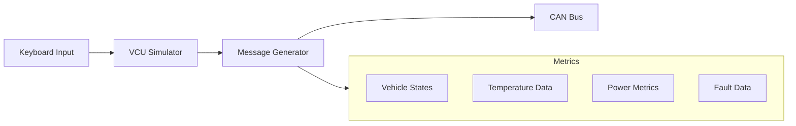

# VCU Simulator
A VCU simulator for electric vehicle development using Python and CAN bus communication.

## Overview
This project simulates a VCU, providing real-time state changes and vehicle metrics over CAN bus. The simulator is designed for developing and testing infotainment and diagnostic systems without requiring actual vehicle hardware.

## Features
- Real-time vehicle state simulation (PARK, DRIVE, REVERSE, CHARGE)
- Constantly changing vehicle metrics generation
- Fault injection and monitoring
- CAN bus communication
- Interactive keyboard controls

## System Architecture


## CAN Message Structure
| Message ID | Description | Length | Rate |
|------------|-------------|---------|------|
| 0x600 | Vehicle State | 8 bytes | 100ms |
| 0x601 | Fault Status | 8 bytes | 100ms |
| 0x101 | Charge Percentage | 1 byte | 200ms |
| 0x201 | Motor Temperature | 1 byte | 200ms |
| 0x301 | Tire Data | 4 bytes | 500ms |

## Prerequisites
- Python 3.11+
- Raspberry Pi with CAN interface
- Virtual environment
- Required Python packages (see requirements.txt)

## Setup Instructions
1. Configure CAN interface on Raspberry Pi:
```bash
# Install required packages
sudo apt-get install can-utils

# Enable CAN interface
sudo ip link set can0 type can bitrate 500000
sudo ip link set up can0
```

2. Create and activate virtual environment:
```bash
python -m venv .venv
source .venv/bin/activate
```

3. Install dependencies:
```bash
pip install -r requirements.txt
```

## Running the Simulator
1. Activate the virtual environment:
```bash
source .venv/bin/activate
```

2. Run the simulator:
```bash
python main.py
```

## Usage Guide
### Keyboard Controls
- `p` - PARK state
- `d` - DRIVE state
- `r` - REVERSE state
- `t` - TRACK mode
- `h` - CHARGE mode
- `f` - Trigger fault
- `c` - Clear fault
- `q` - Quit simulator

### Vehicle States
The simulator supports multiple vehicle states with associated substates and metrics:
- PARK: Base state with systems check
- DRIVE: Active driving with power monitoring
- REVERSE: Reverse operation
- CHARGE: Battery charging simulation
- TRACK: Performance mode with enhanced metrics

## Project Structure
```
fake_vcu_project/
├── src/
│   ├── handlers/
│   │   ├── keyboard_handler.py  # Input processing
│   │   └── message_sender.py    # CAN message generation
│   └── utils/
│       └── can_ids.py          # CAN message definitions
├── main.py                     # Application entry point
├── requirements.txt            # Dependencies
└── README.md                   # Documentation
```

## Development Notes
### Message Generation
- State messages (0x600) include primary state, substate, and status flags
- Fault messages (0x601) include fault source, type, and severity
- Metric messages include simulated sensor data with realistic variations

### Data Ranges
- Motor Temperature: 20-85°C
- Battery Temperature: 15-45°C
- Tire Pressure: 28-36 PSI
- Power Output: -100 to 100 kW

